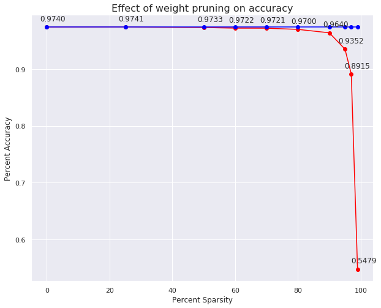
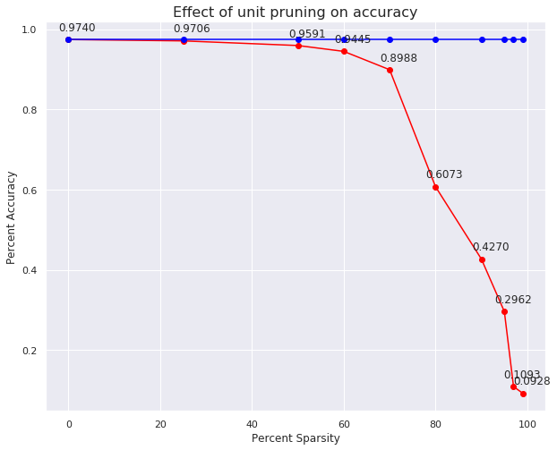

# Pruning-MNIST
Pytorch implementation of pruning in neural networks with mnist data.  (MNIST)

# What is Pruning in Neural Networks? 
Pruning neural networks is an old idea going back to 1990 ([with Yan Lecun’s optimal brain damage work](http://yann.lecun.com/exdb/publis/pdf/lecun-90b.pdf)) and before. The idea is that among the many parameters in the network, some are redundant and don’t contribute a lot to the output. 

If one could rank the neurons according to how much they contribute, and remove the low ranking neurons from the network. You can read more about it [here](https://jacobgil.github.io/deeplearning/pruning-deep-learning).

I have implemented two types of pruning. Namely: 
1. Weight Pruning
2. Unit Pruning

## 1. Weight Pruning
Intuition for weight pruning is rank the weights of each layers by the absolute values and set the smallest k% weights to zero. This would make the network sparse, lowering the number of parameters while keeping the architecture same. 

### Observations: 
As we can see below, high levels of sparsity can be achieved without giving up too much on the accuracy of the network. 

## 2. Unit Pruning (Neuron Pruning)
The intuition for unit pruning is to rank the neurons of each layer by the l2 norm of the corresponding weights and set the smallest k% weights to zero. This would be same as removing the neurons from the network. This would make the architecture smaller while keep the accuracy of the initial larger network.

### Observations: 
As we can see below, high levels of sparsity can be achieved without giving up too much on the accuracy of the network. 

